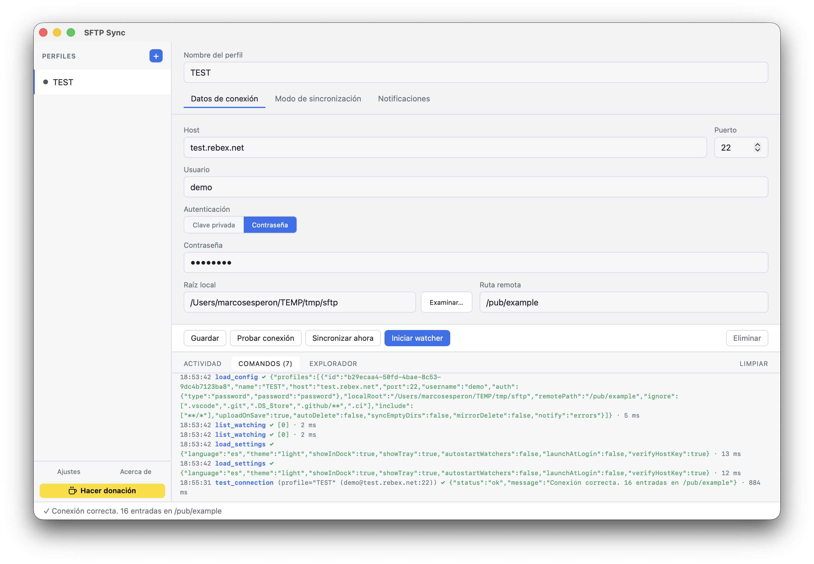
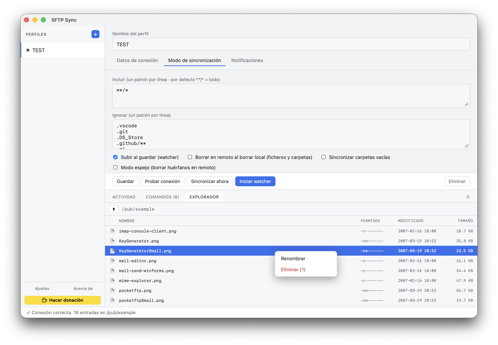
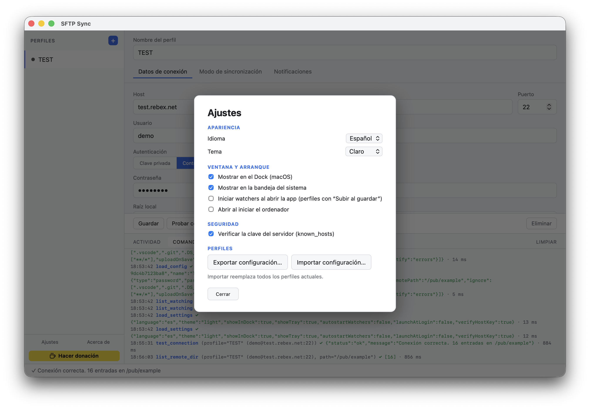
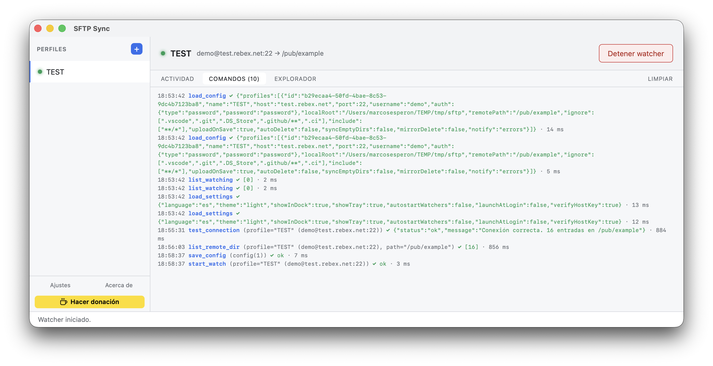

# SFTP Sync

**GUI de escritorio multiplataforma (macOS · Windows · Linux) para sincronización SFTP**, independiente del editor.

Sube ficheros automáticamente al guardar (watcher), respeta patrones `ignore`, soporta múltiples perfiles y autenticación con clave privada o contraseña. Construida con **Tauri 2 + React** y un núcleo en **Rust puro** (sin dependencias nativas en C), lo que produce binarios pequeños y rápidos.

🌐 **Web del proyecto:** [marcosesperon.github.io/sftp-sync](https://marcosesperon.github.io/sftp-sync/) · ⬇️ **[Descargas](https://github.com/marcosesperon/sftp-sync/releases/latest)**

## 📸 Capturas

<table>
  <tr>
    <td width="50%" valign="top">
      
      <sub>Edición de un perfil (pestañas Conexión / Sincronización / Notificaciones)</sub>
    </td>
    <td width="50%" valign="top">
      
      <sub>Explorador remoto con menú contextual y selección múltiple</sub>
    </td>
  </tr>
  <tr>
    <td width="50%" valign="top">
      
      <sub>Ajustes: idioma, tema, ventana/arranque y seguridad</sub>
    </td>
    <td width="50%" valign="top">
      
      <sub>Monitorización en segundo plano con el watcher activo</sub>
    </td>
  </tr>
</table>

---

## ✨ Funcionalidad

### Conexión y autenticación
- **SFTP sobre SSH** mediante [`russh`](https://crates.io/crates/russh) (implementación pura en Rust).
- Autenticación por **clave privada** (con *passphrase* opcional) o por **contraseña**.
- **Compatibilidad RSA moderna**: para claves RSA prueba automáticamente `rsa-sha2-512` → `rsa-sha2-256` → `ssh-rsa`, evitando el típico rechazo de los servidores OpenSSH actuales que ya no aceptan firmas SHA‑1.
- **Prueba de conexión** que autentica y lista la ruta remota; si falla, informa de **qué métodos de autenticación acepta el servidor**.
- **Verificación de la clave del servidor** (host key) con modelo TOFU y `known_hosts` propio; ver [Notas de seguridad](#-notas-de-seguridad).

### Sincronización
- **Subir al guardar (watcher):** vigila la carpeta local de forma recursiva y sube los cambios automáticamente. Usa *debounce* para agrupar la ráfaga de eventos que generan los editores al guardar (escritura temporal + renombrado).
- **Sincronización completa manual** ("Sincronizar ahora"): recorre todo el árbol local y sube lo que no esté ignorado, recreando la estructura de carpetas en el remoto (`mkdir -p`).
- **Conexión SFTP persistente** durante el watcher, con reconexión automática, para que cada subida no pague el coste del *handshake*.
- Ambas operaciones (prueba de conexión y sincronización) son **cancelables** desde la UI: si el servidor tarda o se cuelga, un botón aborta la operación de verdad y restablece la edición.

### Opciones por perfil
| Opción | Descripción |
|---|---|
| **Subir al guardar** | Activa el watcher (sube los cambios al detectarlos). |
| **Borrar en remoto al borrar local** | Propaga los borrados locales al remoto, **ficheros y carpetas** (rmdir recursivo). |
| **Sincronizar carpetas vacías** | Crea también los directorios sin contenido en el remoto. |
| **Modo espejo** | En la sincronización completa, **borra del remoto** lo que ya no existe en local (o está ignorado). Convierte la subida en un espejo real. |
| **Patrones `include`** | Qué ficheros sincronizar (estilo glob). Por defecto `**/*` (todo). Útil para subir solo ciertos tipos: p. ej. `*.php`, `*.js`. Un patrón sin barra (`*.php`) casa a cualquier profundidad. |
| **Patrones `ignore`** | Lista de patrones a excluir, estilo glob/gitignore (`.git`, `.vscode`, `.DS_Store`, `node_modules/**`, …). Se aplica **después** de `include`. |
| **Notificaciones** | Notificaciones nativas del sistema: `Ninguna` · `Solo errores` · `Resumen` (una por ráfaga del watcher / por sync) · `Todas` (una por acción, con tope anti-spam). Se agrupan aprovechando el *debounce* del watcher. |

### Interfaz
- **Gestión de múltiples perfiles** con barra lateral; indicador verde de qué perfiles tienen el watcher activo.
- **Duplicar perfil** con un clic (botón ⧉ al pasar el ratón).
- **Selectores nativos** de fichero (clave privada) y de carpeta (raíz local).
- **Modo monitorización:** cuando el watcher está activo, la pantalla se centra en los logs (nombre del perfil + datos de conexión + botón de detener + paneles a pantalla completa), ocultando la configuración.
- **Panel inferior con tres pestañas:**
  - **Actividad** — operaciones del backend (`↑ subido`, `🗑 borrado`, `📁 carpeta`, errores…).
  - **Comandos** — registro de cada llamada al backend con argumentos, resultado y **tiempo en ms** (las contraseñas y *passphrases* nunca se registran).
  - **Explorador** — navegación del árbol de ficheros remoto vía SFTP (entrar en carpetas, subir de nivel, tamaños), partiendo de la ruta remota del perfil.
- **Menú contextual del navegador desactivado** (salvo en campos de texto, para conservar copiar/pegar).
- **Icono en la bandeja del sistema:** al cerrar la ventana, la app **se minimiza a la bandeja y sigue vigilando en segundo plano**. Desde la bandeja: mostrar la ventana o salir; el tooltip indica cuántos perfiles están activos. Clic en el icono (o en el Dock en macOS) reabre la ventana. **Instancia única** (un segundo arranque enfoca la ventana existente).
- **Tema claro/oscuro** automático según el sistema operativo (o forzado desde ajustes).
- **Multiidioma** (español / inglés), por defecto el del sistema.
- **Pantalla de ajustes** con: idioma, tema, mostrar/ocultar en Dock (macOS) y bandeja, iniciar watchers al abrir la app (perfiles con "Subir al guardar"), abrir al iniciar el ordenador, **verificación de la clave del servidor** (known_hosts) e **importar/exportar** la configuración de perfiles.

---

## 🧱 Stack técnico

| Capa | Tecnología |
|---|---|
| Shell de escritorio | [Tauri 2](https://tauri.app) |
| Frontend | React 19 + TypeScript + [Vite](https://vite.dev) |
| SSH / SFTP | [`russh`](https://crates.io/crates/russh) `0.54` · [`russh-sftp`](https://crates.io/crates/russh-sftp) `2` |
| File watching | [`notify`](https://crates.io/crates/notify) `8` + `notify-debouncer-full` |
| Patrones `ignore` | [`globset`](https://crates.io/crates/globset) |
| Diálogos nativos | `tauri-plugin-dialog` |
| Runtime async | `tokio` |

---

## 📋 Requisitos

- [Rust](https://rustup.rs) (stable)
- [Node.js](https://nodejs.org) ≥ 18 y [`pnpm`](https://pnpm.io)
- Dependencias de sistema de Tauri según tu SO: ver [tauri.app/start/prerequisites](https://tauri.app/start/prerequisites/)

---

## 🚀 Desarrollo

```bash
pnpm install
pnpm tauri dev      # arranca la app con hot-reload del frontend
```

> En **macOS**, las notificaciones nativas se entregan de forma fiable en la app empaquetada (`.app`); en `pnpm tauri dev` pueden no aparecer. Pruébalas con `pnpm tauri build`.

## 📦 Empaquetado

```bash
pnpm tauri build    # genera el binario/instalador para el SO actual
```

Los artefactos quedan en `src-tauri/target/release/bundle/`.

## ✅ Comprobaciones

```bash
pnpm exec tsc --noEmit                 # typecheck del frontend
( cd src-tauri && cargo check )        # typecheck del núcleo Rust
pnpm build                             # build de producción del frontend
```

---

## ⬇️ Instalación (binarios sin firmar)

Los binarios publicados en *Releases* se generan automáticamente y **no están firmados ni notarizados**. La aplicación es segura, pero los sistemas operativos muestran avisos al ser de un desarrollador "no identificado". Así se abren en cada SO:

### 🍎 macOS

Al abrir verás *"No se puede abrir porque Apple no puede comprobar que no contiene software malicioso"*. Tienes tres formas de permitirlo:

1. **Clic derecho → Abrir:** en el `.app` (en Aplicaciones), haz **clic derecho (o Control + clic) → Abrir** y, en el diálogo, pulsa **Abrir**. Solo hace falta la primera vez.
2. **Ajustes del sistema:** tras el primer intento, ve a **Ajustes del Sistema → Privacidad y seguridad** y pulsa **"Abrir de todos modos"**.
3. **Terminal** (quita la marca de cuarentena):
   ```bash
   xattr -dr com.apple.quarantine "/Applications/SFTP Sync.app"
   ```

### 🪟 Windows

Al ejecutar el instalador, **SmartScreen** mostrará *"Windows protegió su PC"*:

1. Pulsa **"Más información"** y luego **"Ejecutar de todas formas"**.
2. Si el aviso persiste, haz **clic derecho sobre el instalador → Propiedades**, marca **"Desbloquear"** abajo y pulsa **Aceptar**.

### 🐧 Linux

Linux no tiene un *gatekeeper* equivalente, pero según el formato:

- **AppImage:** dale permisos de ejecución y lánzalo (requiere FUSE):
  ```bash
  chmod +x SFTP-Sync_*.AppImage
  ./SFTP-Sync_*.AppImage
  ```
- **.deb** (Debian/Ubuntu):
  ```bash
  sudo apt install ./sftp-sync_*.deb
  ```
- **.rpm** (Fedora/openSUSE):
  ```bash
  sudo rpm -i sftp-sync-*.rpm
  ```

> **Nota:** firmar y notarizar la app (Apple Developer ID en macOS, certificado de *code signing* en Windows) eliminaría estos avisos, pero requiere **certificados de pago**. Al tratarse de una aplicación **gratuita**, no se puede asumir ese coste, así que los binarios se distribuyen sin firmar.

---

## ⚙️ Configuración

Los perfiles se guardan como JSON (formato propio) en el directorio de configuración de la app:

- **macOS:** `~/Library/Application Support/com.marcosesperon.sftp-sync/profiles.json`
- **Windows:** `%APPDATA%\com.marcosesperon.sftp-sync\profiles.json`
- **Linux:** `~/.config/com.marcosesperon.sftp-sync/profiles.json`

Normalmente no hace falta editarlo a mano (todo se gestiona desde la UI), pero este es el formato:

```jsonc
{
  "profiles": [
    {
      "id": "uuid-generado",
      "name": "Validación",
      "host": "10.10.10.1",
      "port": 22,
      "username": "admin",
      "auth": {
        "type": "key",                       // "key" | "password"
        "privateKeyPath": "/ruta/clave.key",
        "passphrase": "secreto"              // opcional
        // para contraseña: { "type": "password", "password": "secreto" }
      },
      "localRoot": "/Users/tu/proyecto",     // carpeta local a sincronizar
      "remotePath": "/var/www/",             // carpeta remota destino
      "ignore": [".git", ".vscode", ".DS_Store", ".github/**"],
      "include": ["**/*"],                   // qué sincronizar (**/* = todo; p. ej. ["*.php"])
      "uploadOnSave": true,                  // activar watcher
      "autoDelete": false,                   // propagar borrados (ficheros y carpetas)
      "syncEmptyDirs": false,                // crear carpetas vacías
      "mirrorDelete": false,                 // modo espejo (borrar huérfanos en remoto)
      "notify": "errors"                     // "off" | "errors" | "summary" | "all"
    }
  ]
}
```

---

## 🔒 Notas de seguridad

- **Las credenciales se guardan en claro** en `profiles.json` (en el directorio de configuración de la app). No lo subas a ningún repositorio. (Pendiente: moverlas al keychain del SO.)

### Verificación de la clave del servidor (host key)

Para mitigar ataques *man-in-the-middle*, la app verifica la clave del servidor SSH con un modelo **TOFU** (*Trust On First Use*), al estilo de OpenSSH:

- Las claves confiadas se guardan en un fichero **`known_hosts` propio** de la app (en su directorio de configuración), **sin tocar** tu `~/.ssh/known_hosts`.
- **Primera vez que conectas a un host:** al pulsar *Probar conexión*, si la clave es desconocida, la app muestra su **huella SHA256** y pide confirmación antes de confiarla. Si aceptas, se guarda y las conexiones posteriores (sincronización, watcher, explorador) funcionan sin más.
- **Si la clave cambia** respecto a la guardada, se muestra una **alerta destacada** (posible suplantación) y hay que confirmar explícitamente para continuar.
- Se puede **desactivar** en *Ajustes → Seguridad* ("Verificar la clave del servidor"), volviendo a aceptar cualquier clave (no recomendado).

**Cómo está implementado:** la verificación ocurre durante el handshake SSH (`check_server_key`), que es síncrono y no puede abrir un diálogo. Por eso, cuando la clave no es de confianza, la conexión se **rechaza** devolviendo un error tipado con la huella; la UI muestra el diálogo de confirmación y, al aceptar, el comando `trust_host_key` guarda la clave en `known_hosts` (`learn_known_hosts_path`) y se **reintenta** la conexión. El punto natural para establecer la confianza es *Probar conexión*; una vez confiada, el resto de operaciones conectan sin fricción.

---

## 🏗️ Arquitectura

```
src/                       Frontend React
  types.ts                 Tipos espejo del modelo Rust
  App.tsx                  UI: perfiles, edición, monitorización, logs (invoke + listen)
  App.css                  Estilos
  main.tsx                 Entry point (desactiva el menú contextual)
src-tauri/src/
  config.rs                Modelo de configuración + persistencia JSON
  ignore.rs                Compilación de patrones ignore a GlobSet
  sftp.rs                  Conexión russh + operaciones SFTP (subir, borrar, listar, mkdir)
  sync.rs                  Mapeo de rutas local→remoto, sync completa y modo espejo
  watcher.rs               Watcher notify con debounce, reconexión y manejo de carpetas
  events.rs                Eventos hacia la UI (log de actividad, estado del watcher)
  commands.rs              Comandos #[tauri::command] + estado compartido (watchers, cancelaciones)
  lib.rs                   Wiring del builder de Tauri
```

### Comunicación frontend ↔ backend

**Comandos** (`invoke`): `load_config`, `save_config`, `test_connection`, `cancel_test`, `sync_now`, `cancel_sync`, `start_watch`, `stop_watch`, `list_watching`.

**Eventos** (`listen`):
- `sftp-log` — líneas del log de actividad por perfil.
- `sftp-watch-state` — cambios de estado del watcher (activo/inactivo).

---

## 🗺️ Hoja de ruta

- [ ] Credenciales en el keychain del SO ([`keyring`](https://crates.io/crates/keyring)).
- [ ] Soporte **FTP/FTPS** ([`suppaftp`](https://crates.io/crates/suppaftp)).

---

## 👤 Autor

**Marcos Esperón** — [@marcosesperon](https://github.com/marcosesperon)

Repositorio: [github.com/marcosesperon/sftp-sync](https://github.com/marcosesperon/sftp-sync)

---

## ☕ Apoyar el proyecto

Si esta herramienta te resulta útil, puedes invitarme a un café:

[](https://buymeacoffee.com/marcosesperon)

---

## 📄 Licencia

Distribuido bajo licencia **MIT**. Consulta el fichero [LICENSE](LICENSE) para más detalles.
